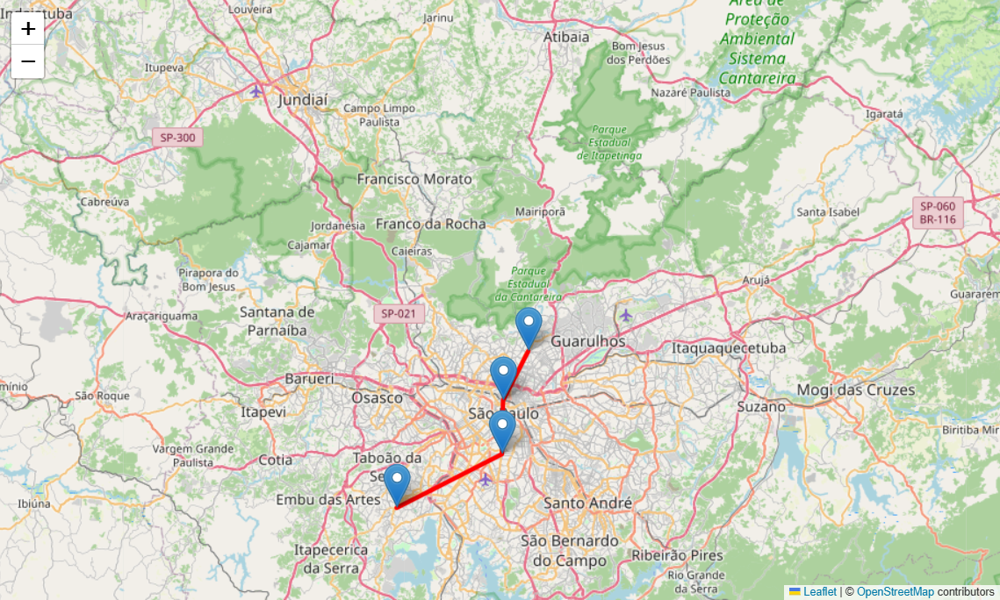
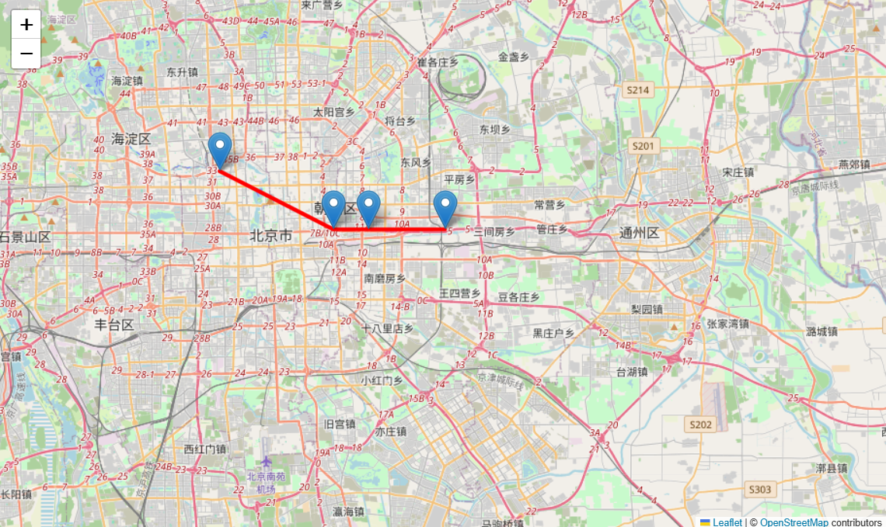
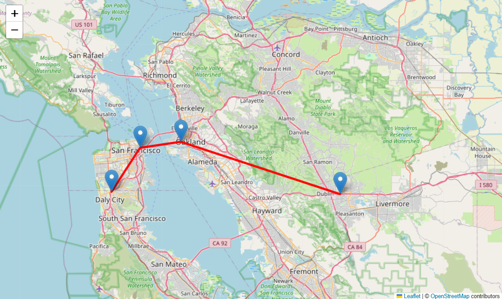

# CP2_Dynamic-Programming
Projeto montado para o checkpoint 2 na diciplica de  (FIAP — Dynamic Programming)

# Grupo
Gabriel Oliveira Amaral - RM 563872
Felipe Yamaguchi Mesquita - RM 556170
Rafael Tavares Santos RM - 563487

Mapas:

